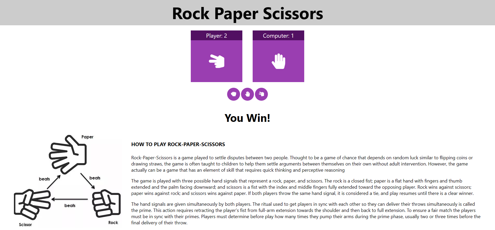
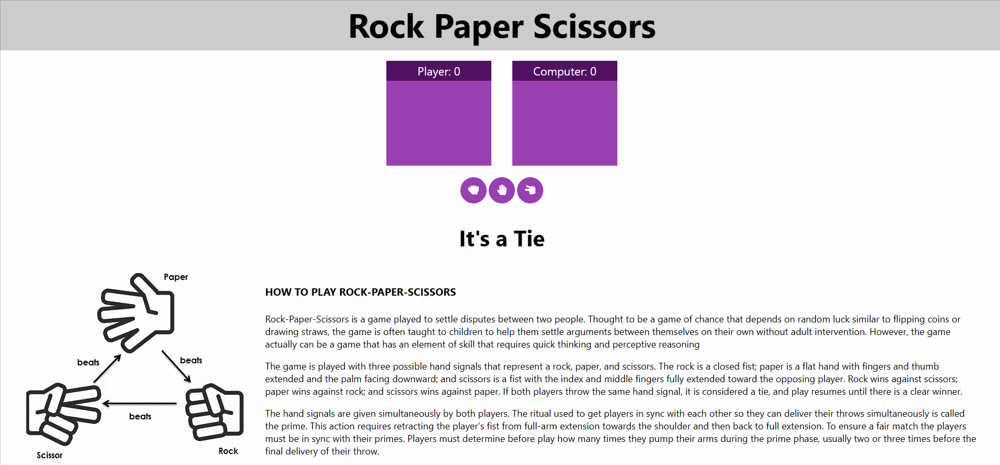

# Rock Paper Scissors Game
> _by Saloni_

This webpage titled Rock Paper Scissors Game is a simple rock paper scissors app, and it is made using React App.

 * ## Tech Stack

    
    
    
    
    

 * ## Knowledge Gained

   1. Building react project.
   2. Having fun with coding.

 * ## Output:

   

 * ## Functionality Added:

   1. The game is between the user and the computer.
   2. The computer will randomly select his option.
   3. The user is able to select their option from the interface.
   4. Total score will be displayed as the game progresses.
   5. Winner will be displayed after the game over.
   6. User is also getting rules/instruction in the screen.

 * ## Functionality Demonstration:

   